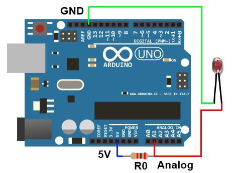

# NTC Thermistor Library

For Arduino boards.

The Library implements a set of methods for working with a NTC thermistor.
Provides a temperature reading in Celsius, Fahrenheit and Kelvin.

## Installation

1. [Download](https://github.com/YuriiSalimov/NTC_Thermistor/releases) the Latest release from gitHub.
2. Unzip and modify the Folder name to "NTC_Thermistor" (Remove the '-version')
3. Paste the modified folder on your Library folder 
(On your `libraries` folder inside Sketchbooks or Arduino software).
4. Restart the Arduino IDE.

## Circuit Diagram

Connect to the analog side of an Arduino Uno. Run 5V through the thermistor, 
then a pull-down resistor, and into ground. To measure the temperature pull a 
line off the junction of the thermistor and the resistor, and into an analog pin 
(A1 here).



R0 - reference resistance.

## Methods

```
	/**
		pin - an analog port number to be attached 
			to the thermistor.
		R0 - reference resistance.
		Rn - nominal resistance.
		Tn - nominal temperature in Celsius.
		B - b-value of a thermistor.
	*/
    NTC_Thermistor thermistor(pin, R0, Rn, Tn, B);
    
    // Read a temperature in Celsius.
    thermistor.readCelsius();
    
    // Read a temperature in Kelvin.
    thermistor.readKelvin();
	
    // Read a temperature in Fahrenheit.
    thermistor.readFahrenheit();
    // For older devices.
    thermistor.readFarenheit();
```

Created by Yurii Salimov.
